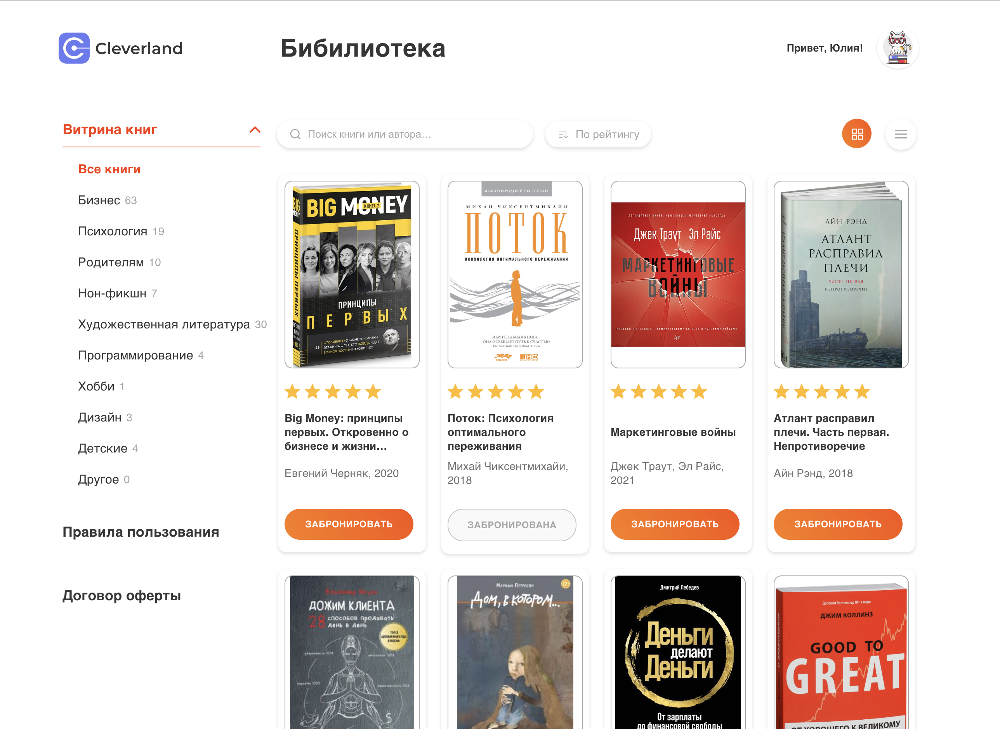

[![Contributors][contributors-shield]][contributors-url]
[![Forks][forks-shield]][forks-url]
[![Stargazers][stars-shield]][stars-url]
[![LinkedIn][linkedin-shield]][linkedin-url]

 

 

 <h3 align="center">Online Library</h3>
 
Clevertec marathon project development. Stage: code refactor, creating a user account.
 
   
    <a href="https://github.com/Julia-Kovalchuk/clevertec-frontend-lab-project"><strong>Explore the docs »</strong></a>
     
     
    <!-- This site is live <a href="https://julia-kovalchuk.github.io/react-pixema/">here</a> -->
 
 

[contributors-shield]: https://img.shields.io/github/contributors/Julia-Kovalchuk/react-pixema.svg?style=for-the-badge
[contributors-url]: https://github.com/Julia-Kovalchuk/react-pixema/graphs/contributors
[forks-shield]: https://img.shields.io/github/forks/Julia-Kovalchuk/react-pixema.svg?style=for-the-badge
[forks-url]: https://github.com/Julia-Kovalchuk/react-pixema/network/members
[stars-shield]: https://img.shields.io/github/stars/Julia-Kovalchuk/react-pixema.svg?style=for-the-badge
[stars-url]: https://github.com/Julia-Kovalchuk/react-pixema/stargazers
[linkedin-shield]: https://img.shields.io/badge/-LinkedIn-black.svg?style=for-the-badge&logo=linkedin&colorB=555
[linkedin-url]: https://www.linkedin.com/in/julia-kovalchuk-6608a2156/
[typescriptlang.org]: https://img.shields.io/badge/-Typescript-blue?style=for-the-badge&logo=typescript&logoColor=white
[typescript-url]: https://www.typescriptlang.org/
[react.js]: https://img.shields.io/badge/React-20232A?style=for-the-badge&logo=react&logoColor=61DAFB
[react-url]: https://reactjs.org/
[axios-http.com]: https://img.shields.io/badge/-axios-671ddf?style=for-the-badge&logo=axios&logoColor=white
[axios-url]: https://axios-http.com/ru/docs/intro
[firebase.google.com]: https://img.shields.io/badge/-firebase-5f6368?style=for-the-badge&logo=firebase&logoColor=orange
[firebase-url]: https://firebase.google.com/docs/
[redux-toolkit.js.org]: https://img.shields.io/badge/-redux--toolkit-764abc?style=for-the-badge&logo=redux&logoColor=white
[redux-url]: https://redux-toolkit.js.org/
[react-hook-form.com]: https://img.shields.io/badge/-react--hook--form-1e2a4a?style=for-the-badge&logo=react-hook-form&logoColor=ec5990
[react-hook-form-url]: https://react-hook-form.com/
[github.com/rt2zz/redux-persist]: https://img.shields.io/badge/-redux--persist-persist?style=for-the-badge
[persist-url]: https://github.com/rt2zz/redux-persist#readme
[framer.com]: https://img.shields.io/badge/-framer--motion-DD0031?style=for-the-badge&logo=framer&logoColor=black
[framer-url]: https://www.framer.com/
[react-select.com]: https://img.shields.io/badge/-react--select-FF3E00?style=for-the-badge
[react-select-url]: https://react-select.com/home
[reactrouter.com]: https://img.shields.io/badge/React_Router-CA4245?style=for-the-badge&logo=react-router&logoColor=white
[react-router-url]: https://reactrouter.com/
[styled-components]: https://img.shields.io/badge/styled--components-DB7093?style=for-the-badge&logo=styled-components&logoColor=white
[styled-components-url]: https://styled-components.com/
[omdbapi.com]: https://img.shields.io/badge/-OMDb%20API%20-blue
[omdb-api-url]: http://www.omdbapi.com/
